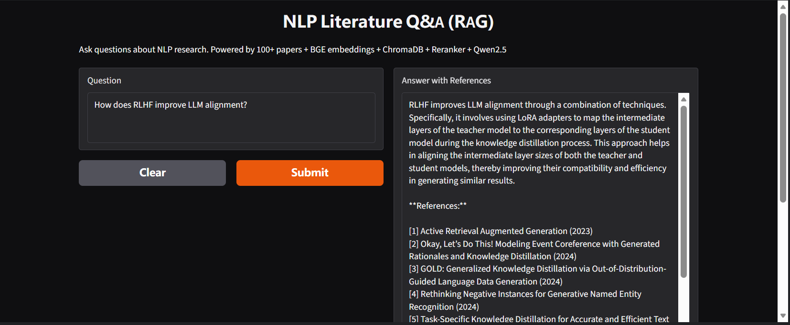

# RAG-based NLP Literature Q&A System

A Retrieval-Augmented Generation (RAG) system that answers NLP research questions by retrieving relevant papers from a corpus of 100+ papers and generating answers with citations.

**Live Demo**: [Gradio Demo](https://39de5db96927edfe82.gradio.live)



## Architecture

```
User Question → BGE Embedding → ChromaDB Vector Search (top-10)
→ BGE Reranker (top-3) → Qwen2.5-0.5B LLM → Answer with Citations
```

## Knowledge Base

- 100+ papers from Semantic Scholar API
- Covers: machine translation, LLM alignment (RLHF), text summarization, multilingual NLP, knowledge distillation

## Experiments

### Chunk Size Impact on Retrieval

| Chunk Size | Chunks | Top-1 Score | Top-5 Avg |
|---|---|---|---|
| 256 | 188 | **0.5884** | **0.5735** |
| 512 | 115 | 0.5633 | 0.5571 |
| 1024 | 113 | 0.5633 | 0.5548 |

Chunk size 256 gives the highest retrieval precision. 512 is used in production as the best trade-off between precision and index size.

### Reranker Impact

| Query | Top-1 w/o Reranker | Top-1 w/ Reranker |
|---|---|---|
| Low-resource MT | Confidence-Based KD (0.60) | Confidence-Based KD (0.74) |

The reranker (BGE-reranker-base) boosts the relevance score of the top-ranked paper, confirming its ranking.

## Key Findings

- RAG prevents hallucination — all answers are grounded in real retrieved papers
- Retrieval quality depends on corpus coverage (100 papers is the main bottleneck)
- Chunk size 256 maximizes precision but increases index size by 60%
- Reranker adds significant value when initial retrieval is noisy

## Usage

```bash
pip install -r requirements.txt
# Download index files from Kaggle output
python app.py
```

## Tech Stack

- **Embedding**: BAAI/bge-small-zh (512-dim)
- **Vector DB**: ChromaDB
- **Reranker**: BAAI/bge-reranker-base
- **LLM**: Qwen2.5-0.5B-Instruct
- **Framework**: LlamaIndex
- **Data**: Semantic Scholar API

## Files

- `train_clean.py` — Clean 8-cell Kaggle notebook
- `train.ipynb` — Kaggle notebook (data crawling, indexing, RAG pipeline)
- `app.py` — Gradio demo
- `requirements.txt` — Python dependencies
